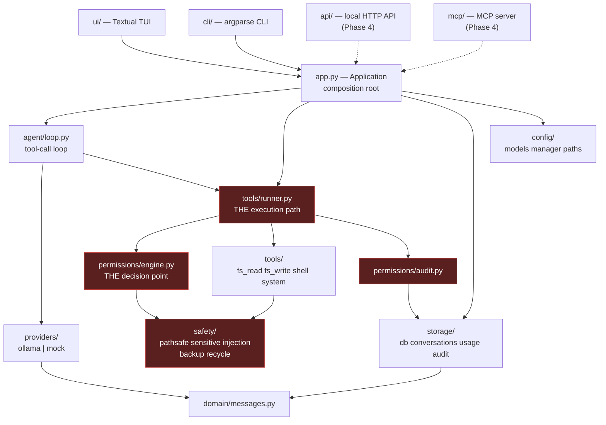

# Architecture

## The shape of it

Dependencies point one way: interfaces depend on the application, the application on
the domain, and nothing depends back. A widget never evaluates a permission; a tool
never opens the database; the agent loop never renders anything.



Red nodes are security-sensitive (see `../CODEOWNERS.md`).

## Layers

| Layer | Responsibility | Depends on |
|---|---|---|
| `ui/` | Textual interface. Presentation only. | app, agent, storage |
| `cli/` | Non-interactive interface for scripts and agents. | app, agent, storage |
| `agent/` | Tool-call loop, guard rails, structured fallback. | providers, tools, domain |
| `tools/` | Capabilities the model can invoke. `runner.py` enforces policy. | permissions, safety, config |
| `permissions/` | The single decision point; the audit trail. | config, safety |
| `safety/` | Containment, classification, injection detection, backups. | — |
| `providers/` | Model backends behind one Protocol, plus discovery of what is installed. | domain, config |
| `storage/` | SQLite and migrations. Nothing else opens the database. | domain |
| `config/` | Typed configuration, atomic persistence, paths. | — |
| `domain/` | Provider-neutral conversation primitives. No I/O. | — |

Machine-readable: `localai architecture --json`.

## Key decisions and why

### Composition root

`Application.create()` in `app.py` builds everything and injects it downward. Nothing
else reaches for a global.

This is what makes the project testable end to end. A test constructs an `Application`
with a temporary home directory and a `MockProvider`, and the entire system — agent
loop, permissions, storage, UI — runs against it with no monkey-patching.

### One execution path

Every tool call goes through `ToolRunner.execute`, which in fixed order: validates
arguments, builds the permission request, evaluates it, obtains confirmation, executes
under timeout, truncates output, scans untrusted content, and audits.

Steps cannot be skipped — there is no parameter that disables them. A tool author
therefore *cannot forget* to check permissions, because tools never check permissions;
the runner does.

### Tools do not receive the engine

`ToolContext` deliberately omits the permissions engine. A tool cannot consult, and so
cannot be tempted to second-guess, a decision that has already been made about it.

### Provider as Protocol, not ABC

`ModelProvider` is a `typing.Protocol`, so a test double needs only structural
conformance. Note `chat` is declared as a **non-async** `def` returning `AsyncIterator`
— implementations are async generators, which return the iterator when called. Declaring
it `async def` would type it as a coroutine that returns an iterator, which is wrong and
mypy catches it.

### Events, not rendering

`AgentLoop.run_turn` yields `AgentEvent` objects. The TUI renders them, the CLI prints
them, tests assert on them. The loop contains no presentation logic and the UI contains
no agent logic. This is why the loop is testable without a terminal and the TUI is
testable without a model.

### Explicit registration

`register_builtins()` names every tool it installs. No directory scanning, no
import-time side effects. Reviewing what a session can do means reading one function —
a maintainability property *and* a security one.

### Storage is a chokepoint

Only `storage/db.py` opens `sqlite3`. PRAGMA settings, migration state and connection
lifetime live in one auditable place. Connections are thread-local because SQLite
connections are not shareable across threads and Textual runs blocking work off the UI
thread; WAL mode lets the usage panel read while the agent loop writes.

### Messages persist incrementally

The agent loop writes each message as it is produced rather than batching at the end of
a turn, so a crash mid-generation loses at most the partial assistant message.

### Discovery is data; rendering is presentation

`providers/discovery.py` reports which backends exist on this machine and how completely
each installed model can be driven — `full` (native tool calling), `fallback` (text
protocol), `chat_only` or `embedding`.

It exposes `summarise()`, which returns pure data. Rendering lives in `cli/main.py`,
because `providers/` must not depend on the interface layer. `doctor` and
`providers scan` both classify through `classify_model`, so the two commands cannot
disagree about which models are usable.

Discovery never raises. An absent or unreachable daemon is a *result* — every caller
wants to report it, not crash on it.

## Adding a model provider

1. Implement the `ModelProvider` Protocol in `src/localai/providers/`.
2. Translate that provider's wire format into `Message`, `ChatChunk`, `ModelInfo` and
   `Usage`. Keep the translation in your module; the domain stays provider-neutral.
3. Set `Usage.token_source` honestly — `REPORTED` only if the provider gave exact
   counts, otherwise `ESTIMATED` or `UNKNOWN`.
4. Wire it into `Application.create`.
5. Add a scripted test double or reuse `MockProvider`.

## Extractors (Phase 3)

Document extractors will implement:

```python
class Extractor(Protocol):
    suffixes: frozenset[str]
    def available(self) -> bool: ...          # is the optional dependency installed?
    def extract(self, path: Path, *, max_bytes: int) -> ExtractedText: ...
```

Registered explicitly like tools. Optional dependencies, with `doctor` reporting which
are missing. Output is untrusted content and goes through the same fencing.

## Phase 4: API and MCP

Both will be thin adapters over `Application`. The requirement is absolute: they call
`PermissionEngine.evaluate` like everything else. **No second, weaker permission path.**
A client identity may select a more restrictive profile; it can never grant permission.
